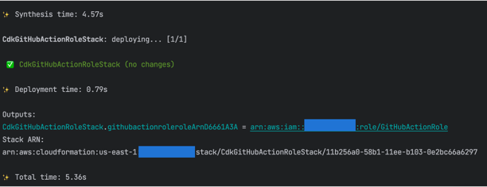

# cdk-github-actions-setup


This CDK app manages the IAM role that can be used to deploy infrastructure through GitHub Actions workflows. Workflows authenticate with IAM via OIDC to retrieve short-lived credentials so that you don't have to store long-term credentials as secrets. To see an example of a stack and workflows that use this `GitHubActionsRole`, check out [evandiewald/cdk-github-actions-sample](https://github.com/evandiewald/cdk-github-actions-sample.git).

#### Why manage this role through IaC and Git?

If you manage this role through a VCS and IaC template, you have a persistent audit log of all permissions changes over time. It also allows you to use normal code review procedures to update these permissions, which allow other repos to provision infrastructure through GitHub Actions.

## Details

### First-Time Setup

#### Add your repository name(s) to the CDK Context Variable

When you initially create the role, it must be deployed from local (not through the GitHub Actions workflow). Add the name of this repository (in OWNER/repo-name) to [`cdk.json`](cdk.json), under `context` --> `repos`. If you know the names of other repos that will use the role, you can add them now or wait until later. The only one you really need right now is the name for THIS repo.

```
# cdk.json

{
  "app": "npx ts-node --prefer-ts-exts bin/cdk-github-actions-setup.ts",
  "watch": {
    "include": [
      "**"
    ...
    ]
  },
  "context": {
    "repos": ["evandiewald/cdk-github-actions-setup"], <--- Add repository names here!
...
```

#### Deploy the Stack from Local (first-time ONLY)

You only need to deploy from local if your deployment/pipeline account does not yet have the `GitHubActionRole` IAM role. Make sure this account is [bootstrapped](https://docs.aws.amazon.com/cdk/v2/guide/bootstrapping.html) if not already, then run:

`npm install`

`npm run build`

`npm run cdk deploy`

The deployment will print out the ARN of the `GitHubActionRole` as a CFN Output. Save this ARN as a secret called `ACTIONS_ROLE_ARN` in this repository and in any other repositories that will authenticate via the role.



Once you've run the initial deployment from local, check in code. You should now only deploy changes through the workflows.

### Ongoing Updates

#### Update the `GithubActionRole` to allow workflows to use it from other repositories

Any new repositories that plan to use this role to provision infrastructure must be added to the `repos` context variable (see above). Once that change has been made and the update has been deployed, you can authenticate with the role in workflows like this:

```yaml
# .github/workflows/deploy.yml

...
    - name: Authenticate Via OIDC Role
      uses: aws-actions/configure-aws-credentials@v1-node16
      with:
        aws-region: us-east-1
        role-duration-seconds: 1800
        role-skip-session-tagging: true
        role-to-assume: ${{ secrets.ACTIONS_ROLE_ARN }}
    - name: Deploy - Dev
      run: |-
        npm install -g aws-cdk
        npx cdk deploy --app "./cdk.out/assembly-Dev" --never-approve
```

For a full example, see [`cdk-github-actions-sample`](https://github.com/evandiewald/cdk-github-actions-sample/blob/main/.github/workflows/deploy-dev-staging.yml).